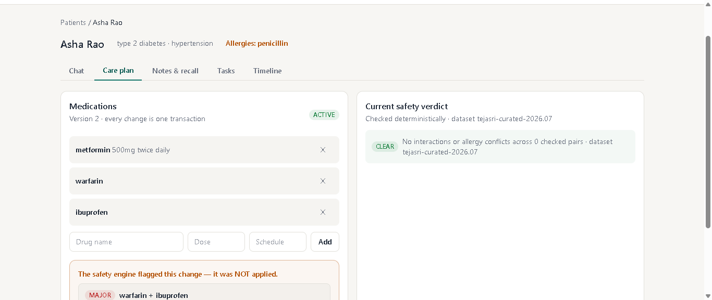
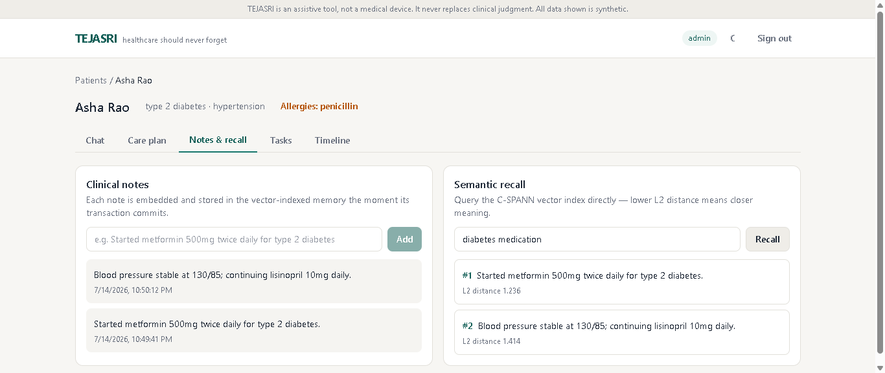
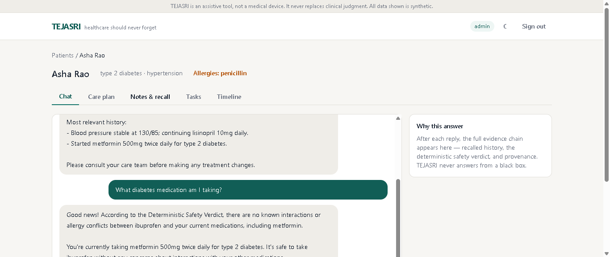
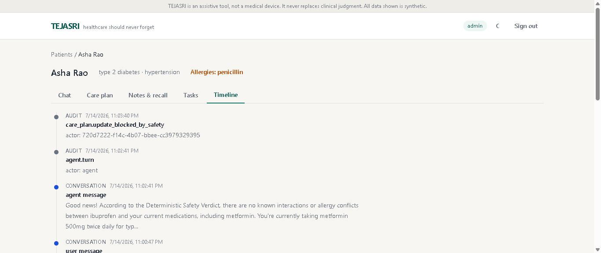

# TEJASRI

[](https://github.com/kanwa2006/TEJASRI/actions/workflows/ci.yml)
[](LICENSE)
[](backend/pyproject.toml)

**Healthcare should never forget.**

TEJASRI (**T**echnology-**E**nabled **J**oint **A**gentic **S**ystem for **R**esilient care & **I**ntelligence) is an open-source **Healthcare Memory Platform**. Its first module is a longitudinal medication-adherence and care-continuity agent whose memory — care plans, conversations, clinical context, and workflow state — lives in a durable, transactional, vector-indexed database that survives failures with zero loss.

> ## ⚠️ Disclaimer
> TEJASRI is an **assistive tool, not a medical device**. It does not diagnose, prescribe, or replace clinical judgment. All recommendations are explanatory, evidence-linked, and require human confirmation. The platform runs exclusively on **synthetic patient data** ([Synthea](https://synthetichealth.github.io/synthea/)) — never real PHI.

---

## Why TEJASRI exists

Medication non-adherence is one of healthcare's largest invisible failures:

- Adherence among chronic-disease patients **averages only ~50%**, lower in developing countries (WHO, *Adherence to Long-Term Therapies*, 2003).
- Non-adherence causes an estimated **125,000 avoidable deaths and $100B+ in preventable costs annually** in the US alone (Kleinsinger, *Perm J*, PMC6045499).

A core reason: **healthcare systems forget.** Context is lost between visits, providers, and conversations. TEJASRI's answer is an agent that *remembers* — reliably, transactionally, and transparently — while humans stay in control.

## Product principles

1. Memory before intelligence.
2. Safety before automation.
3. Doctors before AI.
4. Humans always remain in control.
5. Every recommendation must be explainable.
6. Every action must be auditable.
7. Privacy is mandatory.
8. Transparency over confidence.
9. Production quality over feature count.
10. Simplicity over complexity.

## Architecture

```
                 ┌────────────────────────────────────────┐
   React/Next UI │  Web frontend                            │
   (patient/     │   └─> FastAPI backend                    │
    coordinator) │        ├─ Auth (JWT + Argon2id)          │
                 │        ├─ Agent Orchestrator             │
                 │        │    ├─ LLM Adapter (Gemini/       │
                 │        │    │   Ollama/Bedrock swap)      │
                 │        │    ├─ Memory Store/Recall        │
                 │        │    └─ Deterministic Safety Engine│
                 │        │        (DDInter/openFDA/RxNorm)  │
                 │        └─ MCP client ──► CockroachDB MCP  │
                 └───────────────┬────────────────────────┬─┘
                                 │ SQL (SERIALIZABLE)      │ MCP (read-only, audited)
                                 ▼                         ▼
                    ┌──────────────────────────────────────────┐
                    │  CockroachDB — THE MEMORY LAYER            │
                    │  patients | care_plans | conversations |   │
                    │  clinical_notes(VECTOR+C-SPANN) | tasks |  │
                    │  audit_log   (all RLS multi-tenant)        │
                    └──────────────────────────────────────────┘
        AWS: Lambda (nightly adherence/embedding job) + S3 (datasets, backups, audit archive)
```

**The memory model is load-bearing by design:**

| Memory type | Storage | Guarantee |
|---|---|---|
| Short-term (conversations) | `conversations` table | SERIALIZABLE transactions |
| Transactional (care plans, tasks) | `care_plans`, `tasks` state machine | Versioned, atomic transitions |
| Long-term semantic (clinical notes) | `clinical_notes` with `VECTOR(384)` + C-SPANN index | Searchable the instant its transaction commits |
| Accountability | `audit_log` | Every agent action recorded |

All tables are isolated per tenant with CockroachDB **Row-Level Security** — one clinic can never read another's rows, even through a shared connection.

**Safety design:** drug-interaction and allergy checks are **deterministic** (DDInter / openFDA / RxNorm datasets). The LLM only *explains* the deterministic result — it can never invent or override a severity rating.

## What's built (v1)

- **Memory-aware agent** — every answer grounded in vector-recalled history
  (C-SPANN, L2, per-patient index prefix) with the evidence and distances
  shown in the UI. Conversation history, care plans, and tasks are durable
  SERIALIZABLE state.
- **Deterministic safety engine** — drug–drug interactions and allergy
  cross-sensitivity from a versioned, source-cited dataset. The LLM only
  explains; a code-level check guarantees every flag is disclosed, and
  safety-flagged care-plan changes are blocked until a human acknowledges.
- **Graceful degradation** — Gemini → Ollama failover → deterministic
  template answers. Total LLM outage reduces eloquence, never safety.
- **Multi-tenant isolation** — Row-Level Security forced at the database,
  tested at the app's real least-privilege credentials (ADR 0006).
- **Resilience, demonstrated** — `python scripts/demo_resilience.py` races
  five concurrent agents, hard-restarts the database mid-session, and
  verifies zero loss with instant vector recall.
- **Operations** — structured JSON logs with per-turn trace IDs, Prometheus
  `/metrics`, rate limiting, audit trail, AWS Lambda nightly adherence job
  + S3 archival.
- **Frontend** — calm, accessible React UI: agent chat with a full
  explainability panel, care-plan editor with the safety gate, semantic
  recall explorer, task board, unified timeline, dark/light themes.

## Screenshots

| The safety gate — a flagged change is blocked until a human acknowledges | Semantic recall — querying the C-SPANN vector index live |
|---|---|
|  |  |

| Agent chat with the explainability panel | Unified patient timeline |
|---|---|
|  |  |

## Source of truth & documentation

The complete product specification lives in [docs/BLUEPRINT.md](docs/BLUEPRINT.md).

| | |
|---|---|
| [Memory system](docs/MEMORY_SYSTEM.md) | Why memory is load-bearing — the core design |
| [Architecture](docs/ARCHITECTURE.md) · [ADRs](docs/adr/) | Layering and every major decision |
| [API reference](docs/API.md) | All endpoints |
| [Development](docs/DEVELOPMENT.md) · [Testing](docs/TESTING.md) | Setup and quality gates |
| [Deployment](docs/DEPLOYMENT.md) · [DR](docs/DISASTER_RECOVERY.md) · [Troubleshooting](docs/TROUBLESHOOTING.md) | Operations |
| [Observability](docs/OBSERVABILITY.md) · [Env vars](docs/ENVIRONMENT_VARIABLES.md) | Runtime |
| [Interview guide](docs/INTERVIEW_GUIDE.md) | Defend every decision |
| [Judge walkthrough](docs/hackathon/JUDGE_WALKTHROUGH.md) · [Demo script](docs/hackathon/DEMO_SCRIPT.md) · [Devpost draft](docs/hackathon/DEVPOST.md) | Hackathon kit |

## Repository layout

```
backend/    FastAPI application (clean architecture: domain / application / infrastructure / api)
frontend/   React + Vite + Tailwind patient/coordinator experience
aws/        Lambda nightly job (adherence checks + audit archival to S3)
docs/       Blueprint, architecture, ADRs, guides, hackathon kit
scripts/    Resilience demo, load test
```

## Quickstart (15 minutes, $0, fully offline-capable)

Prerequisites: Python 3.12+, Node 20+, Docker.

```bash
# 1. The memory layer
docker run -d --name crdb -p 26257:26257 \
  cockroachdb/cockroach:latest-v25.2 start-single-node --insecure

# 2. Backend
cd backend
python -m venv .venv && . .venv/Scripts/activate   # .venv/bin/activate on Unix
pip install -e ".[dev]"
export DATABASE_URL=postgresql://root@localhost:26257/defaultdb?sslmode=disable
python -m tejasri.cli migrate && python -m tejasri.cli create-app-user
export DATABASE_URL=postgresql://tejasri_app@localhost:26257/defaultdb?sslmode=disable
export JWT_SECRET_KEY=$(python -c "import secrets;print(secrets.token_hex(32))")
pytest                                             # full suite incl. RLS + memory proofs
uvicorn tejasri.main:app --port 8000

# 3. Frontend (new terminal)
cd frontend && npm install && npm run dev          # http://localhost:5173

# 4. The money shot
python scripts/demo_resilience.py                  # concurrency + restart + zero loss
```

No LLM key needed — without one the agent answers in its deterministic
degraded mode; add `GEMINI_API_KEY` or a local Ollama for full prose.

Quality gates (run before every commit):

```bash
ruff check . && ruff format --check . && mypy src && pytest   # backend
npm run build                                                 # frontend
```

## Roadmap

**v1 (current):** medication-adherence & care-continuity agent — durable memory core, deterministic safety engine, explainable recommendations, multi-tenant isolation, resilience demo.

**Vision (extension modules, out of v1 scope):** Hospital Memory · Care Continuity · Clinical Timeline · Caregiver Portal · Emergency Summary · Doctor Workspace · FHIR interoperability · Longitudinal Patient Intelligence.

## Contributing

See [CONTRIBUTING.md](CONTRIBUTING.md). Security reports: see [SECURITY.md](SECURITY.md).

## License

[MIT](LICENSE)
